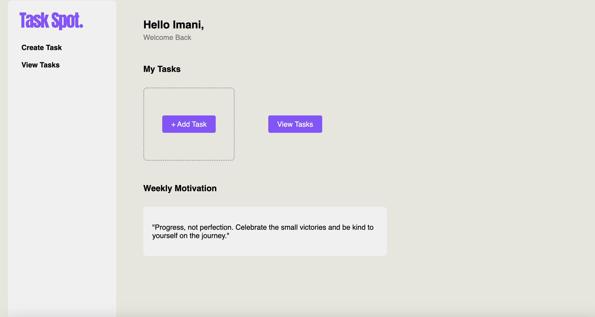

# Task Spot

Task Spot is a task management application that I designed to help users organize their tasks efficiently. Unlike traditional task managers, Task Spot focuses on providing users with motivation and positivity rather than emphasizing task completion.

## Features

- **Task Creation**: Easily create new tasks with detailed information such as name, category, due date, start and end time, and description.
- **Task Viewing**: View all created tasks in a user-friendly interface, categorized by status.
- **Task Completion**: Mark tasks as complete to track progress.
- **Motivational Quotes**: Instead of emphasizing task completion, Task Spot provides users with motivational quotes to encourage positive thinking and self-worth.

## How It Works

Task Spot offers a simple and intuitive user interface. Users can create tasks by filling out a form with relevant details, view their tasks, mark tasks as complete, delete tasks, and receive motivational quotes to stay positive throughout their task management journey.

## Special Feature: Motivational Quotes

Task Spot understands that completing tasks is just one aspect of productivity. Instead of focusing solely on task completion, Task Spot prioritizes the mental well-being of its users by providing motivational quotes. These quotes serve as reminders that self-worth is not determined by productivity and encourage users to celebrate progress, no matter how small.

## Screenshots

## Usage

1. Clone the repository: `git clone https://github.com/TumiMoshou/task-spot.git`
2. Install dependencies: `npm install`
3. Run the application: `npm start`

## Deployed Site

The application is deployed and accessible on [Netlify](https://rococo-nasturtium-b6f3ad.netlify.app).

## Technologies Used

- React
- React Router
- CSS
